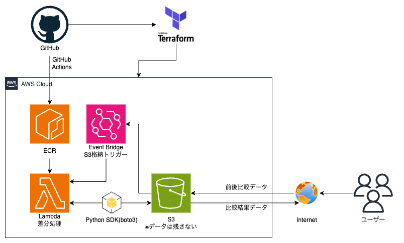

# PDF-difference-checker

## 実行前の確認

- AWS CLI がインストールされている。`~/.aws/credentials`が作成されており、AWS アカウントが登録されている。作成されているフォルダは大抵以下。

```
/Users/~/.aws/credentials
```

config は以下のように記述（あくまで一例）。

```
[default]
region = ap-northeast-1

[pdf-difference]
region = ap-northeast-1

```

credentials は以下のように記述（あくまで一例）。

```
[default]
aws_access_key_id = AKIA~~
aws_secret_access_key = ~~

[pdf-difference]
aws_access_key_id = AKIA~~
aws_secret_access_key = ~~

```

## Step for Deploy AWS

このアプリケーションを AWS にデプロイする方法です。

### Terraform から AWS にデプロイ

Terraform から AWS にリソースを作成します。
`pdf-difference` という AWS プロファイルから認証情報を読み取っています。
適宜変更してください。

```bash
cd terraform
terraform init
terraform apply
```

> [!Warning]
> AWS から消す・仕舞う・片付けることがしたい場合は
> 以下のコマンドを利用。
> `terraform destroy`

## システム構成図



## AWS Lambda で外部パッケージを使う

Lambda Layer にパッケージ群を入れる。

3MB 以下は AWS CLI v2 や terraform で転送可能。
10MB 以下は AWS コンソールの Lambda で直接送れる。
それ以上は S3 を経由する必要がある。今回は S3 を経由して送る。

terraform で Lambda 転送用の S3 `_-lambda-trans-bucket` を作成しているので、利用する。

また、Docker で Lambda 環境を再現してインストールする。
(Docker を起動しておくこと)

```bash
cd terraform/lambda_layer
docker pull amazon/aws-sam-cli-build-image-python3.8
docker run -it -v $(pwd):/var/task amazon/aws-sam-cli-build-image-python3.8:latest
```

```
pip install --upgrade pip
```

```
cd python_cv2_layer
pip3 install opencv-python -t ./python
yum install -y mesa-libGL
cp -v /usr/lib64/libGL.so.1 ./python/opencv_python.libs/
cp -v /usr/lib64/libgthread-2.0.so.0 ./python/opencv_python.libs/
cp -v /usr/lib64/libglib-2.0.so.0 ./python/opencv_python.libs/
cp -v /usr/lib64/libGLX.so.0 ./python/opencv_python.libs/
cp -v /usr/lib64/libX11.so.6 ./python/opencv_python.libs/
cp -v /usr/lib64/libXext.so.6 ./python/opencv_python.libs/
cp -v /usr/lib64/libGLdispatch.so.0 ./python/opencv_python.libs/
cp -v /usr/lib64/libGLX_mesa.so.0.0.0 ./python/opencv_python.libs/
cp -v /usr/lib64/libxcb.so.1 ./python/opencv_python.libs/
cp -v /usr/lib64/libXau.so.6 ./python/opencv_python.libs/
cp -v /lib64/libGLdispatch.so.0.0.0 ./python/opencv_python.libs/
cd python
find . -name "__pycache__" | xargs rm -rf
find . -name "*dist-info" | xargs rm -r
find . -name ".DS_Store" | xargs rm
cd ../
zip -r9 python_cv2_layer.zip python/
cd ../
```

```
cd python_pdf2image_layer
pip3 install pdf2image -t ./python
cd python
find . -name "__pycache__" | xargs rm -rf
find . -name "*dist-info" | xargs rm -r
find . -name ".DS_Store" | xargs rm
cd ../
zip -r9 python_pdf2image_layer.zip python/
cd ../
```

- AWS コンソール画面から S3 に入る。
- `_-lambda-trans-bucket` をクリックし、`python_cv2_layer.zip` と `python_pdf2image_layer.zip`をアップロードする。
- それぞれの S3 URI をコピーしておく。
- 次に Lambda に入る。
- 「レイヤー」「レイヤーの作成」をクリックする。以下の画像のように設定する。

- 作成をクリック。
- Lambda の「関数」から「pdf-difference-lambda-function」をクリックする。 Layers をクリック、「レイヤーを追加」で「カスタムレイヤー」を選択。`python_cv2_layer` と `python_pdf2image_layer` で適切なバージョンを選択する。

## How to Usage

1. before、after の順で PDF を S3 に保存するようにする
2. PDF はひとつずつ入れるようにする
3. (今後対応) S3 に入れるフローを作る
4. (今後対応) Lambda 起動中は S3 に入れられないようにする
